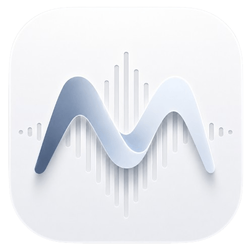
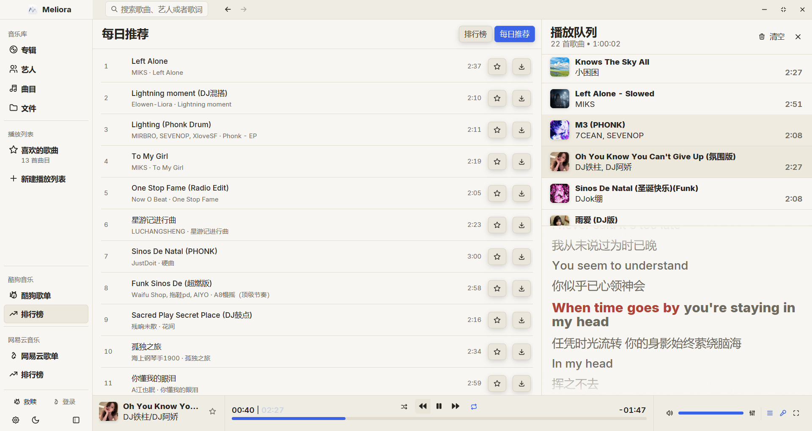
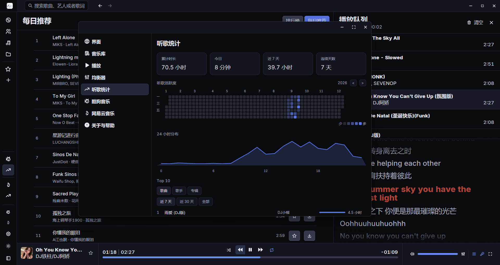
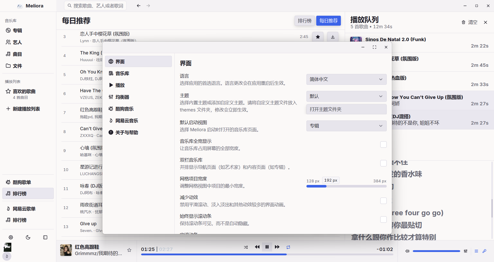

<div align="center">



# Meliora

A fast, fluid desktop music player — for your local library and online streaming.

&nbsp;&nbsp;[**Download**](https://github.com/li-ming1/meliora/releases)&nbsp;&nbsp;·&nbsp;&nbsp;[简体中文](README.md)&nbsp;&nbsp;

[](LICENSE)
[](https://www.rust-lang.org)
[]()

</div>

---

Meliora is a continuation and rewrite of [hummingbird](https://github.com/hummingbird-player/hummingbird). It keeps the local music library and playback capabilities, and adds online services for NetEase Cloud Music and KuGou Music (online catalog, charts, playlists, QR-code login, online streaming and downloading).

> **⚠️ Disclaimer**
>
> This project is a third-party music client developed based on publicly available APIs. It is intended solely for personal learning and technical research.
>
> - **Data source**: All music data is obtained through public interfaces; this project does not store or distribute any audio files
> - **Copyright**: Music content belongs to the original platforms and copyright holders. Please respect intellectual property and support licensed music
> - **Usage restrictions**: Commercial use or any illegal activity with this project is prohibited
> - **Liability**: Any legal disputes or losses arising from the use of this project are the sole responsibility of the user
> - **Dispute resolution**: If the official music platforms consider this project inappropriate, please contact us via Issues

## Features

### Local Library

- Scan and manage your local music library, with automatic folder watching and incremental updates
- Rich metadata parsing (via [lofty](https://crates.io/crates/lofty)): ID3v2, FLAC, MP4, and more
- Embedded cover-art extraction and caching, with Album / Artist / Track browsing
- Playlist management: create, reorder, drag-and-drop, import/export
- ReplayGain loudness normalization
- Lyrics support: LRC / KRC / YRC

### Playback

- Multi-format decoding (via [Symphonia](https://crates.io/crates/symphonia)): MP3, FLAC, AAC, ALAC, OGG, WAV, and more
- 10-band equalizer with real-time spectrum visualization
- High-quality resampling ([Rubato](https://crates.io/crates/rubato))
- Play queue management and session persistence

### Online Services (features)

- NetEase Cloud Music (`netease`): QR-code login, search, playlists, charts, online streaming and downloading
- KuGou Music (`kugou`): VIP privileges granted on QR-code login; search, playlists, charts, online streaming and downloading

### UI & System

- Natively rendered UI (GPUI), responsive layout, light and dark themes
- System media controls: Windows SMTC, macOS Now Playing, Linux MPRIS
- Supports Windows / macOS / Linux

## Screenshots







## Building

### Prerequisites

- Rust toolchain `stable` (pinned to `stable-x86_64-pc-windows-msvc` on Windows, see `rust-toolchain.toml`)
- **Windows**: VS2026 MSVC C++ toolchain, Windows SDK and CMake (`opusic-sys` links native audio-processing libs; icon embedding also needs `rc.exe` from the SDK)
- **Linux / macOS**: GPUI platform dependencies (X11/Wayland or AppKit, system font libraries, etc.) — see [gpui-ce](https://github.com/gpui-ce/gpui-ce)

A standard toolchain installation builds out of the box. If yours has a non-standard layout (e.g. VS2022 not registered with vswhere, SDK/CMake outside default locations), write your real paths into a local copy of [.cargo/config.toml.example](.cargo/config.toml.example) and [build-release.cmd.example](build-release.cmd.example) (these hold private paths and are not committed).

### Base build (local playback)

The default build enables no online features — suitable for a pure local library:

```bash
cargo build --release
```

### Enabling online services

Online services are opt-in via features; append them to your build command:

```bash
# KuGou + NetEase (recommended)
cargo build --release --features kugou,netease

# only one provider
cargo build --release --features kugou
cargo build --release --features netease
```

### Feature reference

| feature | purpose |
|---|---|
| `kugou` | KuGou Music online service (QR-code login, search, playlists, charts, streaming and downloading); pulls in `online` + `online_sources` |
| `netease` | NetEase Cloud Music online service, same aggregation |
| `online` | Base dependency for online services (HTTP client) |
| `online_sources` | Shared online-track plumbing: HTTP-range streaming, cover cache, online queue items; auto-enabled by the provider features above |
| `console` | [tokio-console](https://github.com/tokio-rs/console) runtime diagnostics |
| `runtime_shaders` | Compile GPUI shaders at runtime (for shader debugging) |

Note: `default = []` — a plain build includes none of the features above.

### One-shot Windows build

On Windows, prefer the in-repo `build-release.cmd`: it prepends your local MSVC / Windows SDK / CMake paths to PATH and builds a release (defaults to `--features kugou,netease`):

```powershell
.\build-release.cmd
```

### Run & data

- Data directory: `%APPDATA%\meliora\data\` (settings.json, library.db, playback session, ...)
- Log file: `%LOCALAPPDATA%\meliora\data\meliora.log`
- Full reset: quit the app, then delete both `meliora` folders above

## Acknowledgments

This project references the following open-source projects:

| Project | Purpose |
|---|---|
| [NeteaseCloudMusicApiEnhanced/api-enhanced](https://github.com/NeteaseCloudMusicApiEnhanced/api-enhanced) | Reference implementation for the NetEase Cloud Music API; the endpoints in `src/netease/` mirror it |
| [MakcRe/KuGouMusicApi](https://github.com/MakcRe/KuGouMusicApi) | Reference implementation for the KuGou Music API; the endpoints in `src/kugou/` mirror it |
| [hummingbird-player/hummingbird](https://github.com/hummingbird-player/hummingbird) | The predecessor of this project; Meliora is a continuation and rewrite of its codebase |

In addition, the UI icons come from [Tabler Icons](https://tabler.io/icons) (MIT License, see `assets/icons/LICENSE`).

## ⭐ Support the project

If you find this project helpful, give us a Star! Your support keeps us improving.

[](https://github.com/li-ming1/meliora)

## ✅ Feedback

For any questions or suggestions, feel free to open an [issue](https://github.com/li-ming1/meliora/issues) or [pull request](https://github.com/li-ming1/meliora/pulls).

## License

This project is released under the **Apache License 2.0**. See [LICENSE](LICENSE).

When using the online services (NetEase Cloud Music / KuGou Music), please comply with the terms of the respective platforms and applicable law. This project is for learning and communication purposes only.
